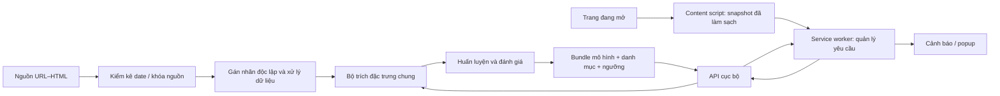

# Technical specification v0.1

Trạng thái: thiết kế khởi đầu, chưa triển khai. Phạm vi theo đề cương đã duyệt. Tham chiếu: đề cương 5.2c–f.

## Kiến trúc

API chỉ phân tích đầu vào gửi đến; không tự truy cập URL hoặc chạy HTML. Crawler là công cụ thu thập riêng trong sandbox, không nằm trong đường suy luận API.

## Stack khởi đầu

- Python cho import, xử lý, đặc trưng và thực nghiệm; môi trường dự án riêng, khóa phiên bản sau thử tương thích.
- scikit-learn cho TF-IDF, Logistic Regression, pipeline và chỉ số; LightGBM là nhánh so sánh M2/M3 sau baseline.
- FastAPI cho API demo cục bộ; OpenAPI 3.1 cho hợp đồng.
- TypeScript và Chrome Manifest V3 cho extension; parser Python xử lý HTML offline, content script lấy DOM runtime.
- JSON/JSONL và file manifest cho cấu hình/nhãn giai đoạn đầu. Chưa cần cơ sở dữ liệu, hàng đợi hoặc dịch vụ cloud.

[FastAPI](https://fastapi.tiangolo.com/), [content scripts Chrome](https://developer.chrome.com/docs/extensions/develop/concepts/content-scripts) là tài liệu kỹ thuật chính thức đã kiểm. Không cài dependency chỉ để dựng tài liệu.

## Ownership

Theo [TEAM](TEAM.md): C sở hữu data/annotation tooling; A/B sở hữu lượt nhãn độc lập; D (chủ nhiệm/lead) sở hữu preprocessing/features/training/evaluation/serving và extension. B kiểm tái lập/chức năng sau khóa nhãn, C kiểm dữ liệu/split.

## Module và hợp đồng nội bộ

**data:** import theo revision, audit date, hash, chuẩn hóa metadata và loại mẫu. Output là index mẫu + manifest; các trường label/target/date được tách khỏi feature input.

**annotation:** C xuất view mù; A/B lưu lượt độc lập; công cụ tính đồng thuận chỉ đọc đúng mẫu ngẫu nhiên; phân xử tạo nhãn cuối và giữ bản gốc.

**preprocessing:** một quy tắc version hóa cho URL/HTML trước features. Đầu vào feature extractor chỉ có URL chuẩn hóa, HTML đã làm sạch, chế độ thu và danh mục được phép; chế độ thu phục vụ QC, không đưa vào vector học.

**features:** URL, DOM, văn bản, tín hiệu mạo danh; hàm `extract(snapshot, dictionary)` không fetch mạng, không đọc nhãn hoặc target. Dữ liệu tính được độc lập có thể cache theo hash + phiên bản; TF-IDF/SVD và tham số thích nghi không fit toàn tập.

**training/evaluation:** nhận index, labels và split đã khóa; tạo pipeline, ngưỡng từ validation nội bộ và dự đoán ngoài mẫu. Manifest run ghi nguồn, split, danh mục và config checksum.

**serving:** load bundle đáng tin cậy của nhóm; xác minh phiên bản preprocessing/features, ngưỡng và checksum danh mục trước ready. Không load mô hình được người dùng upload. Tài liệu [model persistence của scikit-learn](https://scikit-learn.org/stable/model_persistence.html) mô tả yêu cầu tin cậy và tương thích môi trường; lựa chọn định dạng lưu được chốt khi triển khai.

**extension:** content script quan sát trang; service worker gọi API; popup/banner hiển thị trạng thái. Nhận diện do mô hình trả là ứng viên, không trình bày như nhãn tổ chức đã xác minh.

## Tiền xử lý dùng chung

Thiết kế ban đầu: URL giữ scheme/host/path và tên tham số; giá trị query được thay bằng marker cố định, bỏ fragment và userinfo. Giới hạn path chứa token cũng cần quy tắc xác định và fixture trước khóa; không ghi raw URL vào log runtime. Đặc trưng URL dùng đúng biểu diễn này trong huấn luyện và serving, không âm thầm đổi giữa hai môi trường.

HTML loại script, inline handler và giá trị điền trong biểu mẫu/textarea/contenteditable trước gửi; giữ cấu trúc và thuộc tính cần trích đặc trưng. Parser offline không tải tài nguyên. Đếm script/iframe nếu cần phải được tính bằng pipeline thống nhất trước loại, với trường thống kê được kiểm soát phiên bản; API v0.1 chưa nhận các thống kê tự do từ client. Vì vậy những đặc trưng không thể tái lập từ snapshot làm sạch sẽ chưa dùng trong bundle v0.1, phải ghi rõ khi đặc tả M1.

Không thu phím bấm, cookie, storage, mật khẩu/OTP hay lịch sử duyệt. Làm sạch không bảo đảm xóa mọi thông tin cá nhân trong văn bản; demo chỉ chạy trên trang được phép và có công tắc bật phân tích nội dung. Nội dung gửi máy chủ cục bộ cũng cần được giải thích trong giao diện.

## Snapshot và phản hồi

- Điều hướng mới tạo `navigation_id`; mỗi snapshot có `request_id`, `dom_revision` và `phase`.
- Phase `url_only` dùng M0 để cảnh báo sơ bộ; phase `url_content` dùng bundle nội dung đã chọn. M0 sơ bộ không được coi là đánh giá đủ nội dung.
- Chỉ áp dụng kết quả khớp navigation hiện tại và revision mới nhất; bỏ phản hồi đến muộn. Khi snapshot mới đang phân tích, đánh dấu kết quả cũ đã cũ, không coi là xác nhận trang hiện tại.
- DOM thay đổi: debounce dự kiến 500 ms, một request nội dung đang chạy mỗi tab, timeout client dự kiến 5 giây. Đây là tham số kỹ thuật sẽ đo và điều chỉnh, không là cam kết p95.
- Không có mô hình, API lỗi hoặc thiếu nội dung: hiện “Chưa đánh giá được”, không báo an toàn.
- `score` là điểm mô hình, không gọi là xác suất lừa đảo đã hiệu chuẩn. Giải thích là tín hiệu quan sát, không là chứng minh nguyên nhân quyết định.

## Bundle triển khai

Manifest phải có model_id, variant, score_semantics, model checksum, feature/preprocessing version, dictionary checksum, environment lock, training data/split/config hashes và ngưỡng vận hành. Ngưỡng 5% là điểm nghiên cứu; dùng demo phải chọn cấu hình riêng từ validation phát triển và ghi FPR đo được. Bundle phục vụ demo được fit lại trên phần phát triển cho phép; không lấy một mô hình fold test làm bằng chứng hiệu năng toàn hệ thống.

## Quyết định kỹ thuật hiện tại

- ADR-001: API localhost cho demo đầu tiên; ưu tiên dùng lại pipeline Python. Chuyển mô hình vào trình duyệt là tối ưu sau khi có bundle đúng.
- ADR-002: file/manifest thay database ở giai đoạn đầu; cân nhắc thay khi đã có nhu cầu cộng tác thực tế.
- ADR-003: backend không crawler; không thực thi nội dung được gửi.
- ADR-004: dùng chung preprocessing; mọi thay đổi biểu diễn phải tăng version và đánh giá tác động.
- ADR-005: hạ tầng người dùng/tenant là quan hệ chưa xác minh; không whitelist theo nhà cung cấp cho M3 hoặc B-rule.

Stack/ADR là quyết định triển khai có thể tinh chỉnh có ghi nhận; RQ, phạm vi và giao thức nghiên cứu vẫn theo đề cương.
